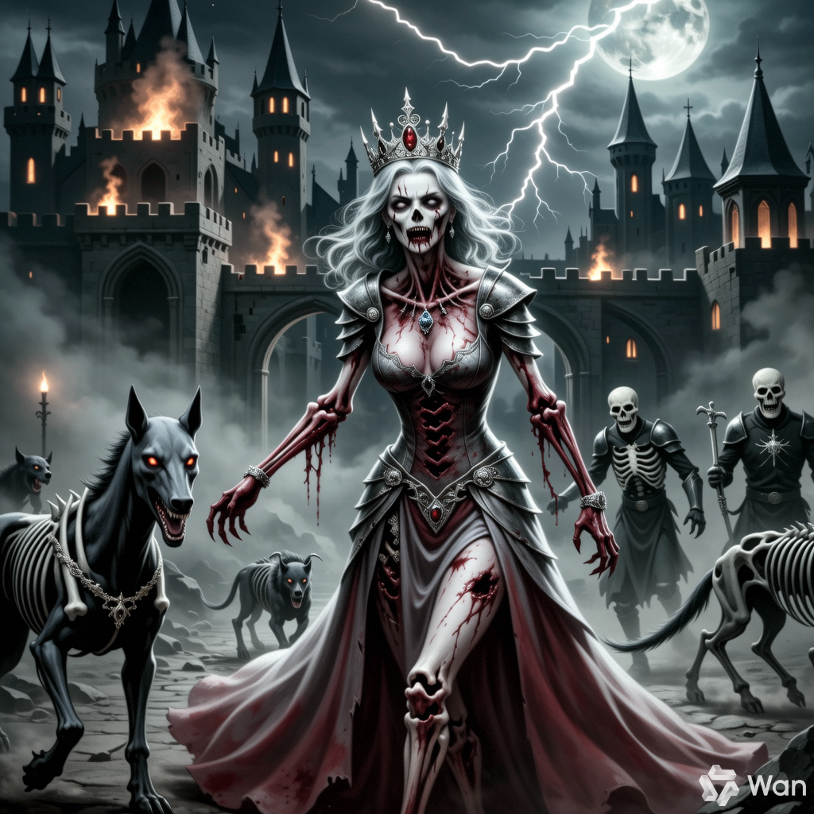

# marduk191_Image_Gallery

marduk191's image gallery

<!-- GALLERY_START -->
## 🖼️ Gallery

|   |   |   |
| --- | --- | --- |
|  |  |  |
|  |  |  |
|  |   |   |

<!-- GALLERY_END -->

Usage (for people using this):

Test It Works
The action should run automatically when you push changes to the images/ folder. You can also:

Go to your repository on GitHub
Click "Actions" tab
Find "Update Gallery" workflow
Click "Run workflow" to trigger it manually

Step 6: Monitor the Action
Watch the action run:

Go to Actions tab in your repo
Click on the workflow run
Check if it completes successfully
Your README should be automatically updated with the gallery

Troubleshooting Tips:

Permissions: The action needs write permissions. If it fails, go to Settings > Actions > General and ensure "Read and write permissions" is enabled
File formats: Supports JPG, PNG, GIF, WebP, SVG
Path: Make sure images are in the images/ directory (case-sensitive)

That's it! Once set up, every time you add/remove/change images in the images/ folder, the gallery will automatically update within a few minutes.
Want me to help with any specific part of the setup?
